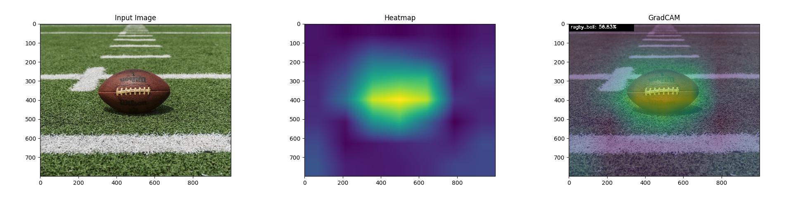

# GradCAM
Tensorflow 2.0 implementation of GradCAM

> This is a GradCAM implementation of pretrained models and also custom trained model



## Instructions

Select any image and run:
```python
    $ python pretrained_gradcam.py --image images/rugby.jpeg
```
## Pretrained Models
#### All pretrained models listed below -
```
 - VGG16 
 - VGG19
 - ResNet50
 - InceptionV3 
 - InceptionResNetV2
 - Xception
 - MobileNet
 - MobileNetV2
 - DenseNet
 - NASNet
 - EfficientNet | Link - https://github.com/qubvel/efficientnet
 
 > NOTE - You need to install `EfficientNet` seperately from the given link because 
   it's not included in keras application.
 ```
You can choose any of the above models, default `VGG16`:
```python
    $ python pretrained_gradcam.py --image images/rugby.jpeg --model VGG16
```

For specific layer GradCAM run below command:
```sh
> model.summary()

Layer (type)                 Output Shape              Param #   
=================================================================
input_1 (InputLayer)         [(None, 224, 224, 3)]     0         
_________________________________________________________________
block1_conv1 (Conv2D)        (None, 224, 224, 64)      1792      
_________________________________________________________________
block1_conv2 (Conv2D)        (None, 224, 224, 64)      36928     
_________________________________________________________________
block1_pool (MaxPooling2D)   (None, 112, 112, 64)      0         
_________________________________________________________________
block2_conv1 (Conv2D)        (None, 112, 112, 128)     73856     
_________________________________________________________________
block2_conv2 (Conv2D)        (None, 112, 112, 128)     147584    
_________________________________________________________________
block2_pool (MaxPooling2D)   (None, 56, 56, 128)       0         

....
....
```
#### Selected the first conv layer of VGG16:
```python
    $ python pretrained_gradcam.py --image images/rugby.jpeg --model VGG16 --layer block1_conv1
```

 
## Custom Model
Run this command to work with your own trained model:

```python
    $ python custom_gradcam.py --image [image] --model [model] --width [w] --height [h] --layer [layer]
```
### Reference
Grad-CAM: Visualize class activation maps with Keras, TensorFlow, and Deep Learning <a href="https://www.pyimagesearch.com/2020/03/09/grad-cam-visualize-class-activation-maps-with-keras-tensorflow-and-deep-learning/">@pyimagesearch</a>

Thanks ❤️ @jrosebr1 

---------------------
<a href="https://github.com/niyazed/GradCAM/blob/master/LICENSE"></a>
